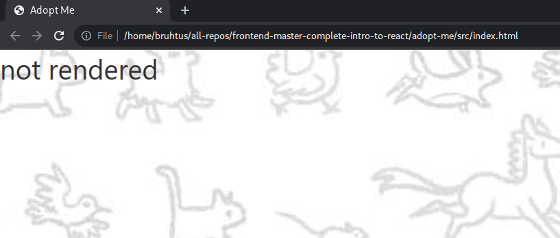
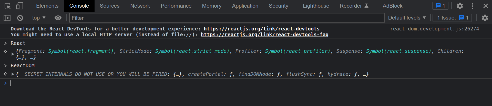
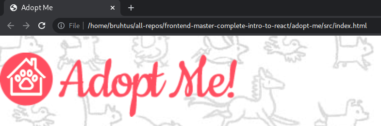

# Frontend Master Complete Intro to React

> React application is fundamentally just a component which is made up
> out of other components which is made up of another component and so on,
> too great depth. It's a lot of components making up other components.

## Pure React

In this section we're gonna write javascript directly into an html file.

First, we need to make `index.html` like this:

```html
<!DOCTYPE html>
<html lang="en">
  <head>
    <meta charset="UTF-8" />
    <meta name="viewport" content="width=device-width, initial-scale=1.0" />
    <meta http-equiv="X-UA-Compatible" content="ie=edge" />
    <link rel="stylesheet" href="./style.css" />
    <title>Adopt Me</title>
  </head>

  <body>
    <!-- if the react hasn't rendered yet, we'll see `not rendered` because react will -->
    <!-- replace whatever in there. -->
    <div id="root">not rendered</div>
    <!-- `unpkg.com` is basically load npm package from the browser -->
    <script src="https://unpkg.com/react@17.0.1/umd/react.development.js"></script>
    <script src="https://unpkg.com/react-dom@17.0.1/umd/react-dom.development.js"></script>
    <script>
      // Your code is going to go here
    </script>
  </body>
</html>
```

and then download the css [here](https://raw.githubusercontent.com/btholt/citr-v6-project/master/01-no-frills-react/src/style.css).
Remember to put the css file in the same directory as `index.html` file.

> Why are we not using `create-react-app`? The problem with `create-react-app`
> is that it's very rigid in its structure and it hides the complexity from us,
> and in this course the instructor want us to see all the complexity, embrace
> the complexity.

Now if we open the `index.html` file in our browser, we'll see something like
this:


If we open the dev tools console, and type `React` and `ReactDOM`, we'll see
that `React` and `ReactDOM` is now defined which means that both of them
successfully loaded from `unpkg.com`.


### Make Pure React Components

Now, inside `<script>` tag in `index.html` file, we'll make a react component.
The result would be similar to this:

```html
<!DOCTYPE html>
<html lang="en">
  <head>
    <meta charset="UTF-8" />
    <meta name="viewport" content="width=device-width, initial-scale=1.0" />
    <meta http-equiv="X-UA-Compatible" content="ie=edge" />
    <link rel="stylesheet" href="./style.css" />
    <title>Adopt Me</title>
  </head>

  <body>
    <!-- if the react hasn't rendered yet, we'll see `not rendered` because react will -->
    <!-- replace whatever in there. -->
    <div id="root">not rendered</div>
    <!-- `unpkg.com` is basically load npm package from the browser -->
    <script src="https://unpkg.com/react@17.0.1/umd/react.development.js"></script>
    <script src="https://unpkg.com/react-dom@17.0.1/umd/react-dom.development.js"></script>
    <script>
      const App = () => {
        return React.createElement(
          'div',
          {},
          React.createElement('h1', {}, 'adopt me!')
        );
      };

      ReactDOM.render(
        React.createElement(App),
        document.getElementById('root')
      );
    </script>
  </body>
</html>
```

> The `{}` in `React.createElement('h1', {}, 'adopt me!')` is for the
> attributes that we want to passed on the html element.
>
> Capitalization of `App` is important because when we use `JSX`, we have to
> capitalize the naming of the components. React will assume that everything
> capitalized is something that we created, and it's gonna assume anything that
> we've lower-cased like `div` to be something like an actual html element.

The result would be something like this:


**The most basic building block in React is that we're using functions and
class to create reusable components**. It's like a class of components and
then we can create instances of that component.

#### Create `App.js`

Now let's create `App.js` and move out the part in `<script>` tag to the
`App.js` like this:

```javascript
const App = () => {
  return React.createElement(
    'div',
    {},
    React.createElement('h1', {}, 'adopt me!')
  );
};

ReactDOM.render(React.createElement(App), document.getElementById('root'));
```

And then we make a `Pet` function like this:

```javascript
const Pet = () => {
  return React.createElement('div', {}, [
    React.createElement('h2', {}, 'Luna'),
    React.createElement('h3', {}, 'Dog'),
    React.createElement('h3', {}, 'Havanese'),
  ]);
};
```

Now, we can use `Pet` function on `App` function like this:

```javascript
const App = () => {
  return React.createElement('div', {}, [
    React.createElement('h1', {}, 'adopt me!'),
    React.createElement(Pet),
    React.createElement(Pet),
    React.createElement(Pet),
  ]);
};

ReactDOM.render(React.createElement(App), document.getElementById('root'));
```

that's called a reusable component, we can use `Pet` component (or function)
in other component over and over again.

#### Props

Now, let's say we want to use `Pet` component for other pet, not only for Luna.
We can do that by using props in `Pet` component like this:

```javascript
const Pet = (props) => {
  return React.createElement('div', {}, [
    React.createElement('h2', {}, props.name),
    React.createElement('h3', {}, props.animal),
    React.createElement('h3', {}, props.breed),
  ]);
};
```

And now, we can use `Pet` component like this:

```javascript
const App = () => {
  return React.createElement('div', {}, [
    React.createElement('h1', {}, 'adopt me!'),
    React.createElement(Pet, {
      name: 'Luna',
      animal: 'Dog',
      breed: 'Havanese',
    }),
    React.createElement(Pet, {
      name: 'Pepper',
      animal: 'Bird',
      breed: 'Cockatiel',
    }),
    React.createElement(Pet, {
      name: 'Sudo',
      animal: 'Dog',
      breed: 'Wheaten Terrier',
    }),
  ]);
};

ReactDOM.render(React.createElement(App), document.getElementById('root'));
```

**This is kind of a magic of React is that we have the ability to pass
information from a parent component down into a child component**.

> With react, data flows down which means we can pass things from `App`
> component into `Pet` component but we can't pass thing from `Pet`
> component into `App` component. That's called one way data flow.
>
> This is the default way of interacting with React.

**A rule of thumb here is put one component in one file in one file**.

### Parcel

Parcel is a bundler for javascript. The advantage of parcel is that parcel
is zero configuration, we just need to point out the entry point for our
application and parcel is smart enough to figure out everything.

And then we put `dev` in our `package.json` like this:

```json
  "scripts": {
    ...,
    "dev": "parcel ./adopt-me/src/index.html"
  },
```

Now, we don't need these script tags:

```html
<script src="https://unpkg.com/react@17.0.1/umd/react.development.js"></script>
<script src="https://unpkg.com/react-dom@17.0.1/umd/react-dom.development.js"></script>
```

We can delete those or commented out those two script tags.

### Babel

Babel is a transpiler tool, it takes code that looks one way and make it look a
different way.

> Transpiling is the process of interpreting certain programming languages
> and translating it to a specific target language.

We can configure babel with `.babelrc` file.

## JSX

JSX hardly do anything for us, it's just taking some kind of xml thing and
outputting that as javascript that a browser can understand.

For example, when we make this:

```javascript
const Pet = (props) => {
  return {
    <div>
      <h2>{props.name}</h2>
      <h2>{props.animal}</h2>
      <h2>{props.breed}</h2>
    </div>
  }
};
```

and pass that into babel and parcel, we will get something like this:

```javascript
const Pet = (props) => {
  return React.createElement('div', {}, [
    React.createElement('h2', {}, props.name),
    React.createElement('h3', {}, props.animal),
    React.createElement('h3', {}, props.breed),
  ]);
};
```

## Hooks

Hooks is basically a way of managing state in our react applications.

For example, let's say we have a text box on the page and it's gonna have
value `first` and then we want to erase it and we want to put `second` in
the text box. That state of the input of text box is gonna be tracked through
a hook.

We have to keep in mind how React works. **Every time that react detects a
change anywhere, it re-run its rendering cycle**.

With that in mind, we can update the state using hooks. Hooks always begin
with `use` like `useState`, `useEffect`, `useDebugValue`, etc.

> This is how we do the data binding between user and the DOM, we just use
> hooks.

**The order of hooks is important**. With that in mind, avoid putting hooks
inside of `for` loops, inside of `if` statements, etc.

> React hooks only re-render the part that changed and leave the other part
> of the page alone.

> If the component ever update the render, we should put that in a state.

## useEffect

useEffect is basically allows us to have side effects to our application.
For example, when we select some item, we want to fetch all the data related
to that item.

In this course we're gonna fetch the pets data using `useEffect`.

## Context

If we have dark mode, it will effect more than just one component, it effect
every component in our application. It's like a universal global state for our
application, and that's where context is very useful.

## References

- [Course website](https://btholt.github.io/complete-intro-to-react-v6/).
- [Course github repo](https://github.com/btholt/complete-intro-to-react-v6).
- [Step-by-step example](https://github.com/btholt/citr-v6-project).
- [React supported events list](https://reactjs.org/docs/events.html#supported-events).
- [React other lifecycle methods documentation](https://reactjs.org/docs/react-component.html).
